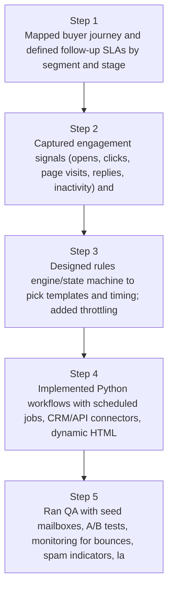
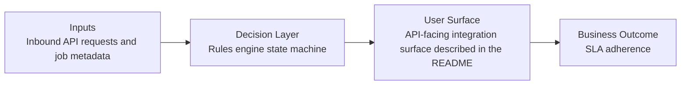
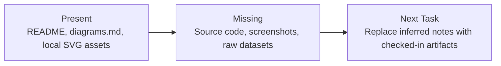

# Engagement-Triggered Follow-Up Automation Diagrams

Generated on 2026-04-26T04:29:37Z from README narrative plus project blueprint requirements.

## Engagement signal → trigger flow

## Rules engine state machine

## Evidence Gap Map

